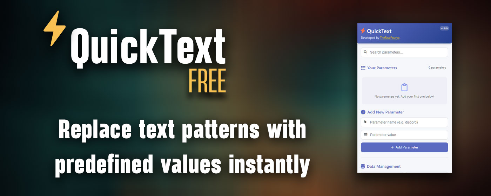

# QuickText Chrome Extension ⚡

  

  <b>Replace text patterns with predefined values instantly</b> 
  Developed by <a href="https://hexquant.xyz">TheRealPourya</a>

  <a href="#features">✨ Features</a> •
  <a href="#installation">📦 Installation</a> •
  <a href="#usage">💡 Usage</a> •
  <a href="#examples">🌟 Examples</a> •
  <a href="#data-management">💾 Data Management</a> •
  <a href="#compatibility">🔄 Compatibility</a> •
  <a href="#license">📄 License</a>

---

## 🔍 Overview

QuickText is a powerful Chrome extension that enhances your typing efficiency by automatically replacing text patterns with predefined values. Perfect for frequently used text snippets, email templates, code blocks, personal information, and more.

Simply type `++parameter_name` in any text field, and it will instantly be replaced with your custom value!

## ✨ Features

- **Instant Text Replacement**: Type `++parameter_name` to instantly insert your predefined text
- **Works Everywhere**: Compatible with standard text inputs, rich text editors, email clients, and more
- **Easy Management**: Add, edit, search, and delete your text parameters through a clean interface
- **Data Security**: All your data is stored locally in your browser, no server communication
- **Import/Export**: Easily backup, restore, and transfer your parameters between devices
- **Seamless Experience**: Works with complex web applications including Discord, Gmail, and React-based apps

  

## 📦 Installation - SOON

### From Chrome Web Store
1. Visit the [QuickText Chrome Extension](https://chrome.google.com/webstore/detail/quicktext/your-extension-id) page
2. Click "Add to Chrome" and confirm the installation
3. The QuickText icon will appear in your browser toolbar

## 💡 Usage

### Adding Parameters
1. Click the QuickText icon in your browser toolbar
2. Enter a parameter name (without the `++` prefix) and its value
3. Click "Add Parameter"

### Using Parameters
1. In any text field on any website, type `++parameter_name`
2. The pattern will be instantly replaced with your defined value

### Managing Parameters
- **Search**: Use the search box to filter your parameters
- **Edit**: Click the edit icon to modify a parameter's value
- **Delete**: Click the delete icon to remove a parameter
- **Copy**: Click the copy icon to copy the parameter pattern to your clipboard

## 🌟 Examples

| You type... | It becomes... |
|-------------|---------------|
| `++email`   | `yourname@example.com` |
| `++phone`   | `(555) 123-4567` |
| `++address` | `123 Main St, Anytown, USA 12345` |
| `++signature` | `Best regards,` `John Doe` `Senior Developer` |
| `++discord` | `YourDiscordID#1234` |

## 💾 Data Management

QuickText includes powerful data management features:

- **Backup**: Create a local backup of your parameters
- **Restore**: Restore parameters from your latest backup
- **Export**: Save parameters to a JSON file for safekeeping or transfer
- **Import**: Load parameters from a previously exported JSON file

## 🔄 Compatibility

QuickText is designed to work with:

- Standard text inputs and textareas
- Rich text editors (Discord, Gmail, etc.)
- Content-editable elements
- React-based applications
- Single-page applications (SPAs)
- iframes (when possible due to same-origin policy)

## 🛠️ Technical Details

QuickText is built with:
- JavaScript
- Chrome Extension APIs
- MutationObserver for dynamic content detection
- Event listeners for keyboard and input events

The extension operates through:
- **content.js**: Monitors text input across websites and performs replacements
- **background.js**: Manages data persistence and synchronization
- **popup.js**: Provides the user interface for managing parameters

## 📄 License

© 2025 TheRealPourya. All Rights Reserved.

This project is proprietary software. Unauthorized copying, modification, distribution, or any other use of this software, via any medium, is strictly prohibited without the explicit written permission of the copyright holder.

For inquiries, contact:
- Email: info@hexquant.xyz
- Website: https://hexquant.xyz
- X/Twitter: [@TheRealPourya](https://x.com/TheRealPourya)

## 🤝 Contributing

This is a proprietary project and is not open for external contributions at this time.

## 📞 Support

If you encounter any issues or have suggestions, please reach out via:
- Email: info@hexquant.xyz
- Website: https://hexquant.xyz
- X/Twitter: [@TheRealPourya](https://x.com/TheRealPourya)

---

   
  Made with ❤️ by <a href="https://hexquant.xyz">TheRealPourya</a>

